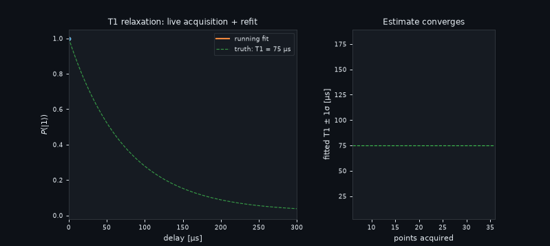
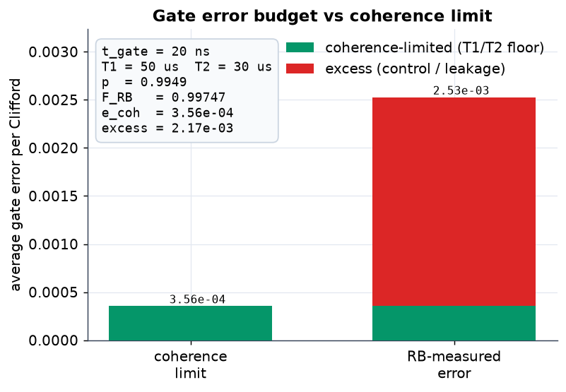
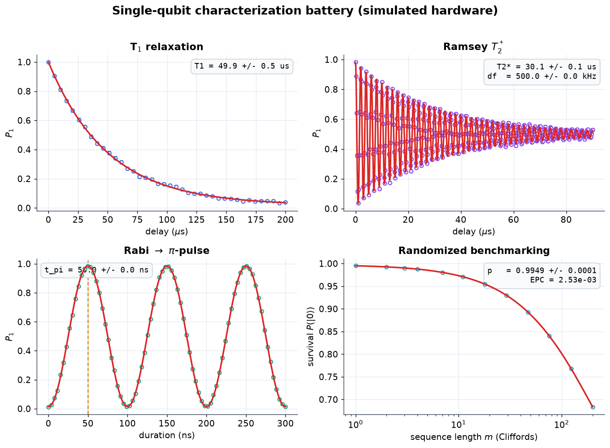
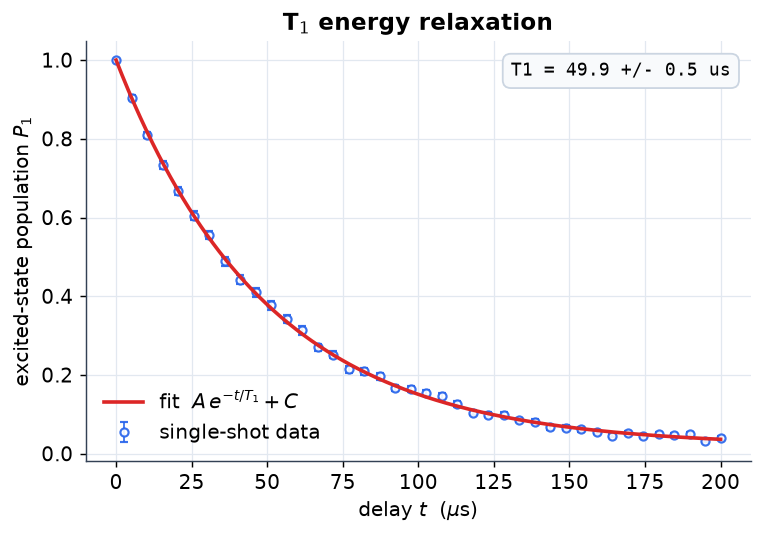
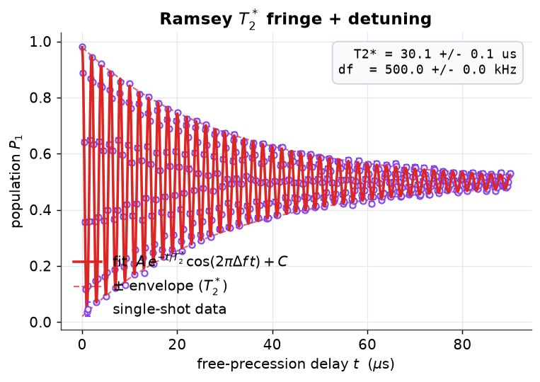
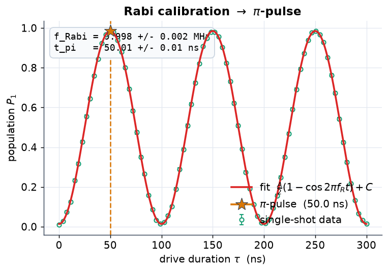
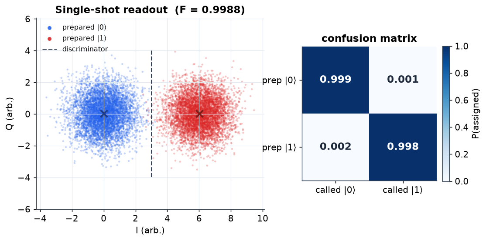
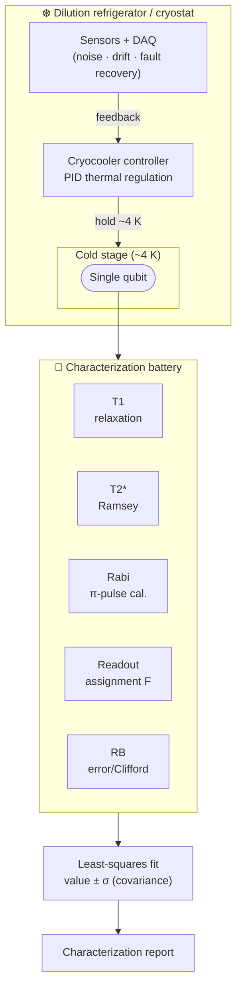

# Quantum Hardware Test Bench

[](https://github.com/earosenfeld/quantum-hardware-testing/actions/workflows/ci.yml)

A **single-qubit characterization bench** — the standard measurements used to
characterize and calibrate superconducting / trapped-ion qubits inside a dilution
refrigerator — together with the **cryostat thermal-control** instrumentation that
supports them.

Each experiment is simulated with realistic readout **shot noise** (binomial
sampling of N single-shot reads per point) and fit by **least squares**, reporting
every parameter with a **covariance-based uncertainty** (`perr = sqrt(diag(pcov))`)
— the same workflow run on real hardware.



*T1 measurement as the bench runs it (`scripts/make_demo_gif.py`): each new
delay point triggers a refit; the covariance-based 1σ bar shrinks onto the
injected 75 µs ground truth.*

## Characterization experiments

| Experiment | Model fit | Extracts |
|---|---|---|
| **T1** energy relaxation | `A·exp(-t/T1) + C` | T1 ± σ |
| **T2\*** Ramsey | `A·exp(-t/T2)·cos(2π·Δf·t + φ) + C` | T2\*, detuning Δf |
| **Rabi** calibration | `A/2·(1 − cos(2π·f_R·t)) + C` | Rabi frequency → π-pulse |
| **Hahn echo** T2 | refocused decay | T2_echo ( > T2\* ) |
| **Readout** assignment fidelity | IQ-plane Gaussian blobs | F, 2×2 confusion matrix |
| **Randomized benchmarking** | `A·p^m + B` | error-per-Clifford |

An optional **QuTiP Lindblad master-equation engine** lets T1/T2 emerge from
open-system dynamics (collapse operators `√Γ₁·σ⁻` and `√(Γφ/2)·σz`). It is imported
lazily — everything else runs on numpy/scipy alone, and the test suite is green
**without** QuTiP installed.

## Gate fidelity & error budget

The primitive measurements feed the two numbers a hardware team reports for a gate
(`qht/qubit/fidelity.py`):

- **Average gate fidelity from RB** — from the RB depolarizing parameter `p`, the
  error per Clifford is `r = (1 − p)·(d − 1)/d` and `F = 1 − r`. For a single qubit
  (`d = 2`) this is `r = (1 − p)/2` — e.g. `p = 0.99 → r = 0.005, F = 0.995`.
- **Coherence limit** — even a perfect pulse loses fidelity while the gate runs;
  the single-qubit floor is `e_coh ≈ (t_gate/3)·(1/T1 + 1/T2)` (`F_coh = 1 − e_coh`),
  the leading-order `t_gate ≪ T1, T2` average over input states. Pass the Ramsey or
  Hahn-echo T2 directly.
- **Error budget** — `excess = e_measured − e_coh` splits the RB-measured error into
  the part forced by decoherence and the **excess** (control / leakage / calibration)
  a better pulse could recover.

```python
from qht.qubit import error_budget
b = error_budget(t_gate=20e-9, T1=50e-6, T2=30e-6, rb_p=0.995)
# b.coherence_error ≈ 3.6e-4   b.measured_error = 2.5e-3   b.excess_error ≈ 2.1e-3
```



*Coherence-limited (green, the T1/T2 floor) vs RB-measured gate error per Clifford;
the red segment is the control/leakage **excess** on top of the floor.*

These are analytic relations evaluated on the bench's simulated RB and coherence
measurements — the same closed forms used to read off a real run.

## Characterization gallery

Every figure shows the **noisy single-shot data** (markers, with binomial error
bars) and the **least-squares fit** (line), annotated with the extracted value and
its **covariance-based 1σ uncertainty** — exactly what is read off a real run.
Regenerate with `python scripts/make_figures.py` (fixed seeds → reproducible).

**One-glance characterization battery** — T1, Ramsey T2\*, Rabi, and randomized
benchmarking on one canvas:



| | |
|---|---|
| <br>**T1 energy relaxation** — excited-state population decays as `A·exp(-t/T1)+C`; the fit recovers **T1 = 49.9 ± 0.5 µs**. | <br>**Ramsey T2\*** — the decaying cosine yields both the dephasing envelope **T2\* = 30.1 µs** and the qubit–drive **detuning Δf = 0.5 MHz** (fringe frequency). |
| <br>**Rabi calibration** — driving on resonance oscillates the population at `f_Rabi`; the first maximum (★) sets the **π-pulse, t_π = 50.0 ns**. | <br>**Single-shot readout** — prepared \|0⟩ (blue) and \|1⟩ (red) form two IQ-plane Gaussian blobs; the optimal linear discriminator gives **assignment fidelity F = 0.999** (2×2 confusion matrix at right). |

## System under test

The qubit lives at the cold stage of a dilution refrigerator; the cryostat
controller holds that ~4 K environment while the characterization battery probes
the qubit:



## Quickstart

```bash
pip install numpy scipy pandas matplotlib reportlab pytest

# Full characterization battery against simulated hardware (known params + noise):
python -m qht.qubit --shots 8192
#   T1 relaxation : 49.7 +/- 0.6 us   (injected 50.0 us)
#   Ramsey T2*    : 29.8 +/- 0.5 us   ...
```

```python
from qht.qubit import simulate_t1, fit_t1

delays, p_hat, sigma = simulate_t1(t1_true=50e-6, n_shots=4096, seed=0)
res = fit_t1(delays, p_hat, sigma)
print(res.T1, "+/-", res.T1_err)      # covariance-based 1σ error bar
```

## Cryostat thermal control (supporting infrastructure)

Qubits operate at ~4 K. The `cryocooler/` package is the cryostat controller that
holds that environment: PID temperature regulation against a lumped thermal model,
simulated sensors with noise/drift, a DAQ layer with fault recovery, and CSV/PDF
reporting. It is the environment the qubit bench runs in — supporting infrastructure,
not the headline.

## Package layout

```
qht/
├── qubit/            # headline: T1 / T2* / Rabi / echo / readout / RB + fits with uncertainty
│   ├── models.py     #   shared fit models + covariance-based FitResult
│   ├── relaxation.py # ramsey.py  rabi.py  hahn_echo.py  readout.py
│   ├── randomized_benchmarking.py
│   └── lindblad.py   #   optional QuTiP master-equation engine
├── cryocooler/       # supporting cryostat thermal control (PID + thermal model + sensors)
├── daq/              # data acquisition + instrument comms
└── utils/            # reporting
```

## Testing

```bash
pytest tests/ -q     # every fit validated against injected ground truth
```

## License

MIT — see [LICENSE](LICENSE).
